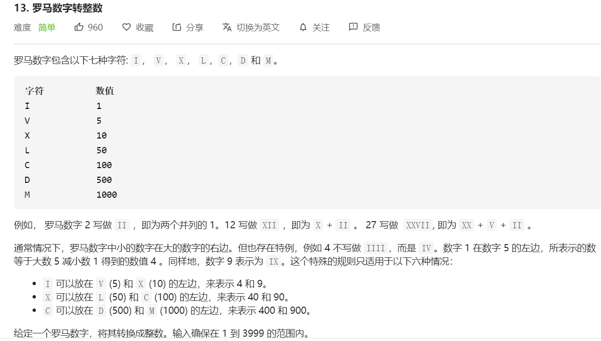

#### 方法一

思路：我首先想到的方法是枚举法。把每种情况都列出来，然后额外考虑三种特殊情况即可。

> I 可以放在 V (5) 和 X (10) 的左边，来表示 4 和 9。<br/>
> X 可以放在 L (50) 和 C (100) 的左边，来表示 40 和 90。<br/>
> C 可以放在 D (500) 和 M (1000) 的左边，来表示 400 和 900。

```javascript
/**
 * @param {string} s
 * @return {number}
 */
var romanToInt = function(s) {
    let result = 0
    let num = 0
    for(let i = 0; i < s.length; i++){
        switch(s[i]) {
            case 'I':
                num = 1
                if(s[i+1] === 'V' || s[i+1] === 'X') {
                    num = -1
                }
                result += num
                break
            case 'V':
                result += 5
                break
            case 'X':
                num = 10
                if(s[i+1] === 'L' || s[i+1] === 'C') {
                    num = -10
                }
                result += num
                break
            case 'L':
                result += 50
                break
            case 'C':
                num = 100
                if(s[i+1] === 'D' || s[i+1] === 'M') {
                    num = -100
                }
                result += num
                break
            case 'D':
                result += 500
                break
            case 'M':
                result += 1000
                break
        }
    }
    return result
}
```

<br/>

#### 方法二

方法一的代码有点冗长，如果情况更多种，那么`case`会更长。于是思考：是不是其实里边有什么规律可循？

关键线索仍在额外的三种特殊情况里。

**思路：我们发现，如果某数字A比右边（即后一位）B的大，那么整体数值是减去A，否则是加上A。**

```javascript
/**
 * @param {string} s
 * @return {number}
 */
var romanToInt = function(s) {
   const map = {
     I: 1,
     V: 5,
     X: 10,
     L: 50,
     C: 100,
     D: 500,
     M: 1000
   }
   let i = 0
   let sum = 0
   let num = 0
   let now = 0
   while(i < s.length) {
     now = map[s[i]]
     if(num < now) { // 如果A（num）比B（now）小，则属于特殊情况，整体减去A
       sum -= num
     }else{	// 反之，如果A（num）比B（now）大，则属于一般情况，整体加上A
      sum += num
     }
     num = now
     i++
   }
   sum += num
   return sum
 }
```

