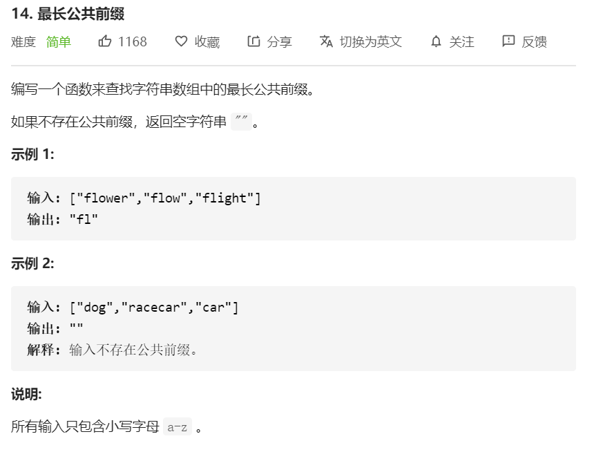

思路

- 注意审题，求解的是最长公共**前缀**，以下标 0 开始计起，**而不是求最长子串**。
- 使用纵向扫描法：以第一个字符串为标准，循环遍历并比较第二个开始的字符串。

```javascript
var longestCommonPrefix = function(strs) {
  if(strs === null || strs.length === 0){
    return ''
  }
  const length = strs[0].length
  for(let i = 0; i< length; i++){
    // 第一层遍历：第一个字符串内部
    const c = strs[0][i]
    // 第二层遍历：第二个～最后一个字符串
    for(let j = 1; j< strs.length; j++){
      if(strs[j][i] !== c || i === strs[j].length) {
        // 不存在公共前缀就是：strs[0].substring(0, 0) = ''
        return strs[0].substring(0, i)
      }
    }
  }
  // 若循环内没有 return，则全部符合
  return strs[0]
}
```

