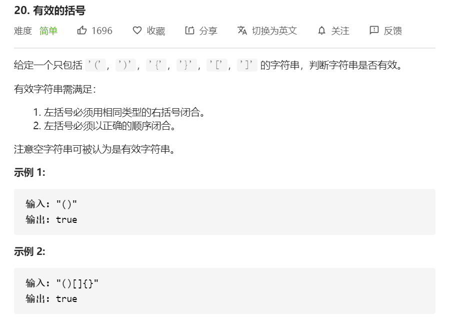

思路：将字符串中的字符依次入栈，遍历字符依次判断。

- **如果是 ( { [，推入栈。**
- **否则，就是 ) } ]，此时将 stack 栈顶的元素取出，看是不是对应的 ( { [。**

```javascript
const isValid = function(s) {
  const map = {
    '(': ')', 
    '{': '}', 
    '[': ']'
  }
  const stack = []
  for(let i = 0; i < s.length; i++){
    // 推入 key 值，即( { [
    if(map[s[i]]){
      stack.push(s[i])
    }else{
      if(s[i] !== map[stack.pop()]){
        return false
      }
    }
  }
  // 注意考虑：当字符串还没被 pop() 全部取完的情况
  return stack.length === 0
}
```

