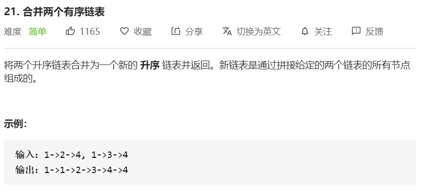

#### 方法一

思路：我首先想到的就是迭代法，所谓暴力法。

- 判断 l1 和 l2 哪一个链表的节点的值更小，将较小值的节点添加到结果里。

- 首先新建一个只有 `-1` 数值的链表，该链表（ `prehead.next` ）就是新合并成的链表（因为不要 `prehead` 的头节点）。

- 最后需要注意：因为 l1 和 l2 长度不一定相等。

  在两两比较后，可能其中一个链表还有剩，这时需要将剩余部分追加在 `prehead` 末尾即可。

```javascript
/**
 * Definition for singly-linked list.
 * function ListNode(val, next) {
 *     this.val = (val===undefined ? 0 : val)
 *     this.next = (next===undefined ? null : next)
 * }
 */
/**
 * @param {ListNode} l1
 * @param {ListNode} l2
 * @return {ListNode}
 */
const mergeTwoLists = function(l1, l2) {
    const prehead = new ListNode(-1)

    let prev = prehead
    while(l1 !== null && l2 !== null){
        if(l1.val <= l2.val){
            prev.next = l1
            l1 = l1.next
        }else{
            prev.next = l2
            l2 = l2.next
        }
        prev = prev.next
    }
    prev.next = l1 === null ? l2 : l1
    return prehead.next
}
```

**复杂度分析**

时间复杂度：O(n + m)，其中 n 和 m 分别为两个链表的长度。

因为每次循环迭代中，l1 和 l2 只有一个元素会被放进合并链表中， 因此 `while` 循环的次数不会超过两个链表的长度之和。

空间复杂度：O(1)。只需要常数的空间存放若干变量。

<br/>

#### 方法二

思路：递归法

leetcode 提供的递归过程建模挺清晰，我觉得对于写递归挺有帮助。

如果 list1[0] < list2[0]，则结果链表放入 list1[0]，list1 剩余部分继续和 list2 同一种规则继续处理。list1[0] >= list2[0] 同理。

**那么，也就是有规律，符合递归。**

```
// 当list1[0] < list2[0]，取 list1[0]：
list1[0] + merge(list1[1~], list2)

// 否则，取 list2[0]
list2[0] + merge(list1, list2[1~])
```

```javascript
const mergeTwoLists = function(l1, l2) {
   if(l1 === null) {
       return l2
   }
   if(l2 === null) {
       return l1
   }
   if(l1.val < l2.val){
       l1.next = mergeTwoLists(l1.next, l2)
       return l1
   }else{
       l2.next = mergeTwoLists(l1, l2.next)
       return l2
   }
}
```

**复杂度分析**

- 时间复杂度：O(n + m)，其中 n 和 m 分别为两个链表的长度。

  因为每次调用递归，都会去掉l1或l2的头节点。

- 空间复杂度：O(n+m)。其中 n 和 m 分别为两个链表的长度。递归调用 `mergeTwoLists` 函数时需要消耗栈空间。