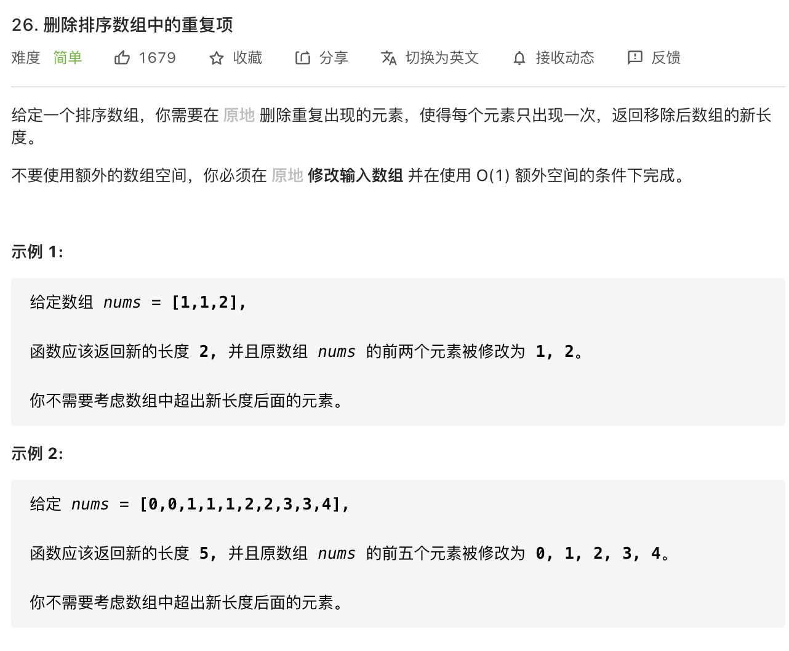

思路：遍历数组，用 `i` 记录下每一个不同的元素，并往前覆盖。

```javascript
/**
 * @param {number[]} nums
 * @return {number}
 */
const removeDuplicates = function(nums) {
    if(nums.length === 0) {
        return 0
    }
    let i = 0
    for(let j = 1; j < nums.length; j++) {
        if (nums[j] !== nums[i]) {
            i++
            nums[i] = nums[j]
        }
    }
    return i+1
}
```

**复杂度分析**

- 时间复杂度：O(n)
- 空间复杂度：O(1)
