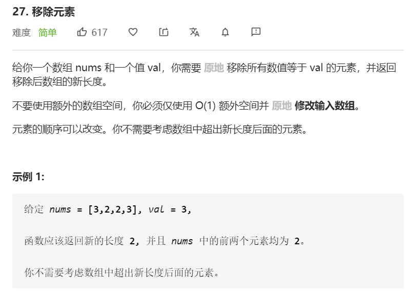

#### 方法一

思路：遍历数组，当元素与 val 不相同时，**将元素往前把 val 覆盖。**

```javascript
var removeElement = function(nums, val) {
     let result = 0
     nums.forEach(ele => {
         if(ele !== val){
            nums[result] = ele
            result++
         }
     })
     return result
 }
```

**复杂度分析**

- 时间复杂度：O(n)
- 空间复杂度：O(1)

<br/>

#### 方法二

思路：

- 方法一的遍历与替换在某些特殊情况下，会显得有些浪费。

  比如 `removeElement([4,1,2,4], 4)`，后面几个不再有4，没必要再往前覆盖。

  比如 `removeElement([1,2,3,4], 4)`，前面几个根本没有4，没必要再往前覆盖。

- 所以：遍历数组，当找到需要删除的值时，从数组末尾调换一个元素到该位置，并且需要遍历的数组长度-1。

```javascript
var removeElement = function(nums, val) {
     let i = 0
     let n = nums.length
     while (i < n) {
         if(nums[i] === val) {
            nums[i] = nums[n - 1]
            n--
         }else{
            i++
         }
     }
     return i
}
```

**复杂度分析**

- 时间复杂度：O(n)

  **在这个方法中，赋值操作的次数等于要删除的元素的数量。**

- 空间复杂度：O(1)