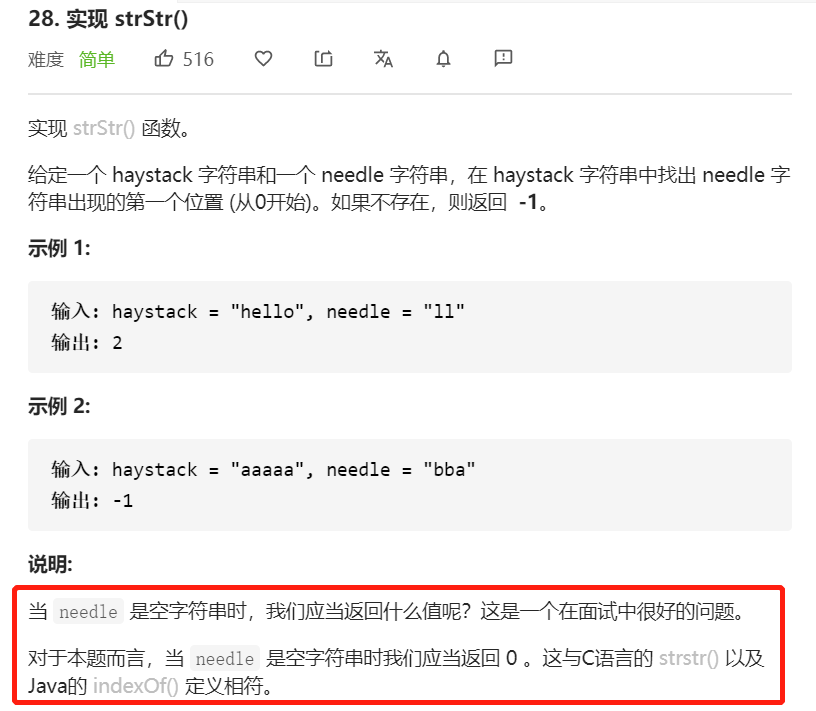

注意：当查找字符为空时，返回0。毕竟 `'aaaaa'.indexOf('') === 0`

#### 方法一

思路：首先想到最最简单粗暴的方法…

使用两层遍历，当外层的第一位匹配时，遍历检查后几位是否相同。当然，这种查找性能是比较差的。

```javascript
const strStr = function(haystack, needle) {
     if (needle === '') {
         return 0
     }
     for (let i = 0; i <= haystack.length - needle.length; i++){
         if (haystack[i] === needle[0]) {
            let flag = true
            for(let j = 1; j < needle.length; j++){
                if(haystack[i+j] !== needle[j]){
                  flag = false
                  break
                }else{
                  flag = true
                }
            }
            if(flag) {
                return i
            }
         }
     }
     return -1
 }
```

<br/>


#### 方法二

方法一如果字符串中重复的字符比较多，该算法的效率就会很慢。其实，这道题的推荐解法是 KMP。

KMP 算法的想法是，设法利用已知信息，不要把"搜索位置"移回已经比较过的位置，继续把它向后移，这样就提高了效率。

本质上就是在遍历基础上的一个改进。

[阮一峰的字符串匹配的KMP算法](http://www.ruanyifeng.com/blog/2013/05/Knuth–Morris–Pratt_algorithm.html)