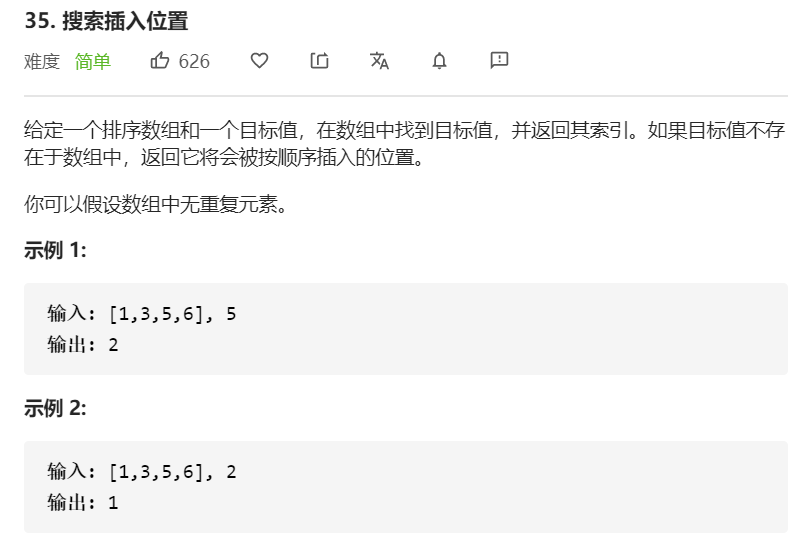

#### 方法一

思路：特别简单的一次遍历，找出 `nums[i] >= target`

```javascript
const searchInsert = function(nums, target) {
    for(let i = 0; i < nums.length; i ++) {
        if(nums[i] >= target) {
            return i
        }
    }
    return nums.length
}
```

<br/>

#### 方法二

思路：leetcode官方题解中提到，若想在排序数组中寻找是否存在一个目标值，训练有素的读者肯定立马就能想到利用二分法。用二分法逼近查找第一个大于等于  target 的下标 。

方法一的时间复杂度为O(n)，二分查找法会比这效率提高不少，毕竟是两头同时找。

```javascript
const searchInsert = function(nums, target) {
    let n = nums.length
    let left = 0
    let right = n - 1
    let res = n
    while(left <= right) {
        let mid = Math.floor((right + left) / 2)
        if(nums[mid] >= target) {
            res = mid
            right = mid - 1
        }else{
            left = mid + 1
        }
    }
    return res
}
```

**复杂度分析**

- 时间复杂度：O(logn)，其中 n 为数组的长度。

- 空间复杂度：O(1)。