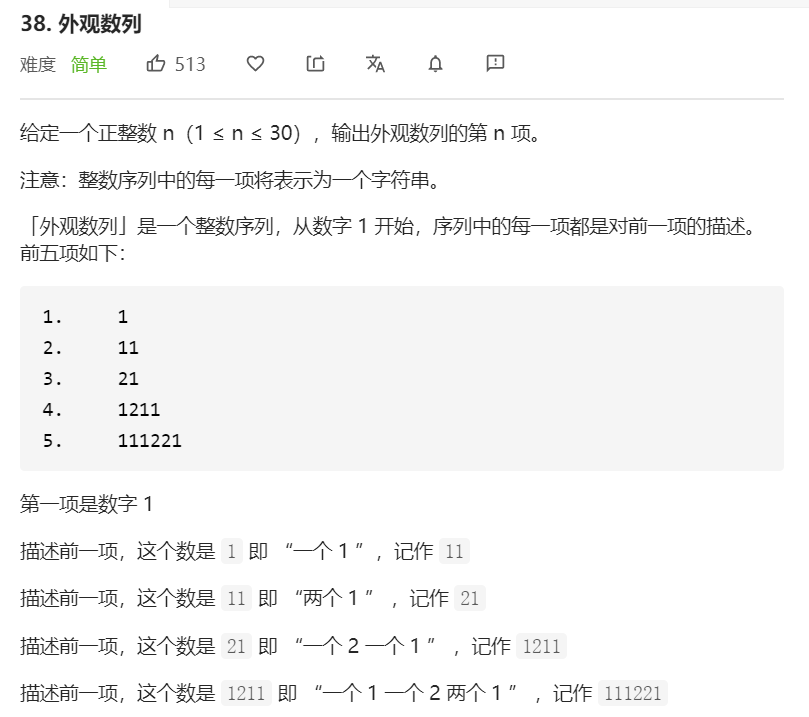

老实说，首先看到这题，我有点没搞懂它说的是什么（黑人问号）？

原来是：每个数字的后一项，就是一个形容当前数字的数字。比如形容21，则是：

`一个2` + `一个1`= `12` + `11` = `1211`

题解区的一个网友用了正则，我觉得挺巧妙的。

- \d 匹配数字 

- \1 指第一个匹配括号内的元素
- * 代表匹配 0 次以上
- 连起来就是匹配连续 0 次以上的数字

```javascript
const countAndSay = function(n) {
     let prev = '1'
     for(let i = 1; i < n; i++) {
         prev = prev.replace(/(\d)\1*/g, item => {
             return `${item.length}${item[0]}`
         })
     }
     return prev
}
```


