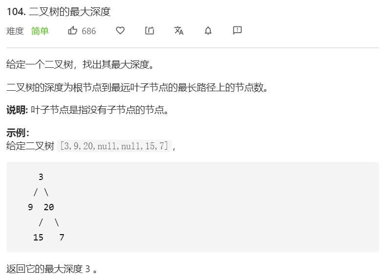

思路：如果我们知道了左子树和右子树的最大深度 `leftDepth` 和 `rightDepth`，那么该二叉树的最大深度即为：

`Math.max(leftDepth + rightDepth) + 1`

而左子树和右子树的最大深度同样可以使用该方法计算得出。递归在访问到空节点时退出。

```javascript
/**
 * Definition for a binary tree node.
 * function TreeNode(val) {
 *     this.val = val;
 *     this.left = this.right = null;
 * }
 */
/**
 * @param {TreeNode} root
 * @return {number}
 */
var maxDepth = function(root) {
      if(root === null) {
        return 0
      }
      let leftDepth = maxDepth(root.left)
      let rightDepth = maxDepth(root.right)
      return Math.max(leftDepth, rightDepth) + 1
}
```

**复杂度分析**

- 时间复杂度：O(n)。
- 空间复杂度：O(n)。取决于递归调用的层数，递归层数不会超过 `n`。

