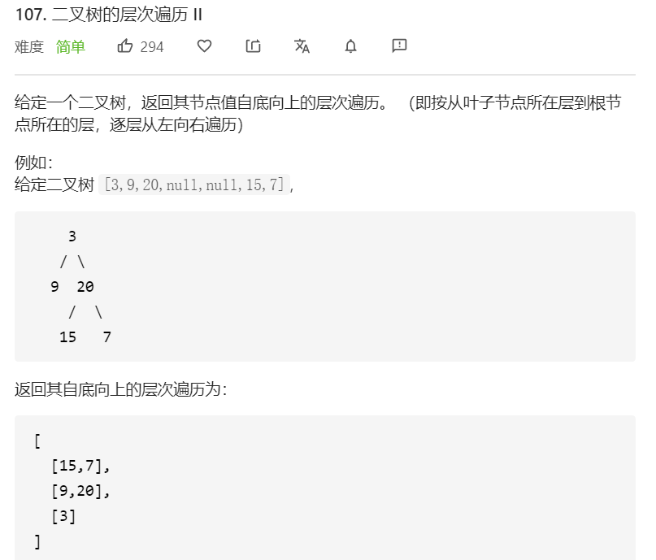

思路：二叉树相关的题目都可以使用递归来解决。

采用 DFS（深度优先遍历），但需要做一些改动：**递归遍历到的同一层节点需要放进同一个列表中。在递归时要记录每一个节点所在的深度。**

```javascript
/**
 * Definition for a binary tree node.
 * function TreeNode(val) {
 *     this.val = val;
 *     this.left = this.right = null;
 * }
 */
/**
 * @param {TreeNode} root
 * @return {number[][]}
 */
var levelOrderBottom = function(root) {
      let result = []
      const traverse = (node, level) => {
        if(node === null){
          return
        }
        result[level] = result[level] || []
        result[level].push(node.val)
        level++
        traverse(node.left, level)
        traverse(node.right, level)
      }
      traverse(root, 0)
      return result.reverse()
}
```

**复杂度分析**

- 时间复杂度：O(n)。
- 空间复杂度：O(n)。取决于递归调用的层数，递归层数不会超过 `n`。

