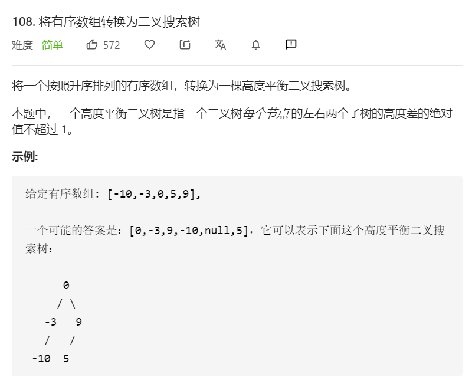

思路：二叉树相关的题目都可以使用递归来解决。

有一个前提是必须要想到的：**二叉搜索树的中序遍历是升序序列，题目给定的数组是按照升序排序的有序数组，因此可以确保数组是二叉搜索树的中序遍历序列。**

第二步需要想到的：既然是中序遍历，那么根节点实际就是最中间的数值，也就是这个数组的中间元素。当然，当长度为奇数，这个中间元素就是刚刚好在中间；否则，需要取中间元素的前一位或后一位作为根节点。

要求二叉搜索树的高度平衡，是否可以唯一地确定二叉搜索树？答案是否定的。因此当执行代码，发现与预期答案对不上，也不要害怕，直接尝试提交即可。

```javascript
/**
 * Definition for a binary tree node.
 * function TreeNode(val) {
 *     this.val = val;
 *     this.left = this.right = null;
 * }
 */
/**
 * @param {number[]} nums
 * @return {TreeNode}
 */
const buildBST = function(nums, left, right) {
      if (left > right) {
        return null
      }
      let mid = Math.floor((left + right) / 2)
      const node = new TreeNode(nums[mid])
      node.left = buildBST(nums, left, mid - 1)
      node.right = buildBST(nums, mid + 1, right)
      return node
    }
var sortedArrayToBST = function(nums) {
      return buildBST(nums, 0, nums.length - 1)
}
```

**复杂度分析**

- 时间复杂度：O(n)。
- 空间复杂度：O(log n)。取决于递归调用的层数，由于是对半递归，递归层数不会超过`log n`。

