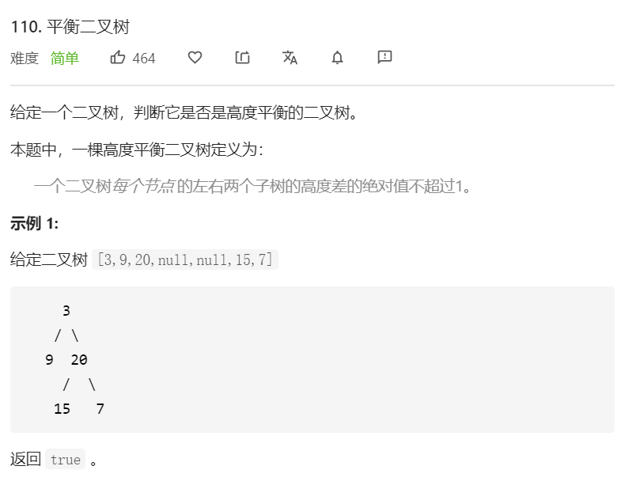

思路：二叉树相关的题目都可以使用递归来解决。

首先要题目提供的注意`平衡二叉树`的概念。


#### 方法一

思路：自顶向下（类似前序遍历）

- 对于当前所在节点，首先计算左右子树的高度。
- 如果左右子树的高度差不超过1，则分别再递归左右子节点，并判断各自的左右子树是否平衡。

```javascript
/**
 * Definition for a binary tree node.
 * function TreeNode(val) {
 *     this.val = val;
 *     this.left = this.right = null;
 * }
 */
/**
 * @param {TreeNode} root
 * @return {boolean}
 */
const checkHeight = function(node) {
      if(node === null) {
        return 0
      }
      let leftHeight = checkHeight(node.left)
      let rightHeight = checkHeight(node.right)
      return Math.max(leftHeight, rightHeight) + 1
}
const isBalanced = function(root) {
      if (root == null) {
          return true
      }
      return Math.abs(checkHeight(root.left) - checkHeight(root.right)) <= 1 && isBalanced(root.right) && isBalanced(root.left)
}
```

**复杂度分析**

- 时间复杂度：O(n^2)。对于最坏的情况，二叉树形成链式结构，高度为 O(n)，此时总时间复杂度为 O(n^2)。
- 空间复杂度：O(n)。取决于递归调用的层数，递归层数不会超过`n`。

<br/>

#### 方法二

因此对于同一个节点，函数 `height` 会被重复调用，导致时间复杂度较高。如果使用自底向上的做法，则对于每个节点，函数 `height` 只会被调用一次。


思路：自底向上（类似后序遍历）

- 对于当前所在节点，首先递归左右子树是否平衡，然后再判断以当前节点为根的左右子树是否平衡。
- 如果一棵子树是平衡的，则返回其高度（高度一定是非负整数），否则返回 `-1`。如果存在一棵子树不平衡，则整个二叉树一定不平衡。

```javascript
const checkHeight = function(node) {
      if(node === null) {
        return 0
      }
      let leftHeight = checkHeight(node.left)
      let rightHeight = checkHeight(node.right)
      if (leftHeight == -1 || rightHeight == -1 || Math.abs(leftHeight - rightHeight) > 1) {
        return -1
      }
      return Math.max(leftHeight, rightHeight) + 1
}
const isBalanced = function(root) {
      return checkHeight(root) >= 0
}
```

**复杂度分析**

- 时间复杂度：O(n)。
- 空间复杂度：O(n)。取决于递归调用的层数，递归层数不会超过`n`。