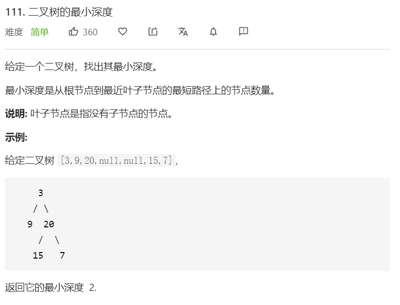

思路：二叉树相关的题目都可以使用递归来解决。

这道题一看和第 `104` 道题“二叉树的最大深度”十分类似，于是我灵机一动，直接把代码复制过来，简单修改即立刻提交。然后，发现报错了……leetcode 提示测试用例[1,2]没通过？


**为什么执行不通过？**

仔细审题，最小深度是指到叶子节点的节点数量。因此当根节点是1，左子树是2，右子树是空时，这种情况下应该返回2，因为1→2，节点数量确实是2。

也就是相比求最大深度，最小深度需要多考虑当 `leftDepth` 和  `rightDepth` 其中一个为0的情况。

**为什么最大深度不需要考虑这种情况？**

因为这种情况下，最大确实是2，不会取较小值。

```javascript
/**
 * Definition for a binary tree node.
 * function TreeNode(val) {
 *     this.val = val;
 *     this.left = this.right = null;
 * }
 */
/**
 * @param {TreeNode} root
 * @return {number}
 */
var minDepth = function(root) {
      if(root === null) {
        return 0
      }
      let leftDepth = minDepth(root.left)
      let rightDepth = minDepth(root.right)
      // 这一个判断不能被忽视
      if(leftDepth === 0 || rightDepth === 0) {
        return Math.max(leftDepth, rightDepth) + 1
      }
      return Math.min(leftDepth, rightDepth) + 1
};
```

**复杂度分析**

- 时间复杂度：O(n)。
- 空间复杂度：空间复杂度：O(h)。其中 `h` 是树的高度。
  - 空间复杂度主要取决于递归时栈空间的开销，最坏情况下，树呈现链状，空间复杂度为 O(n)。
  - 平均情况下树的高度与节点数的对数正相关，空间复杂度为 O(log n)。
