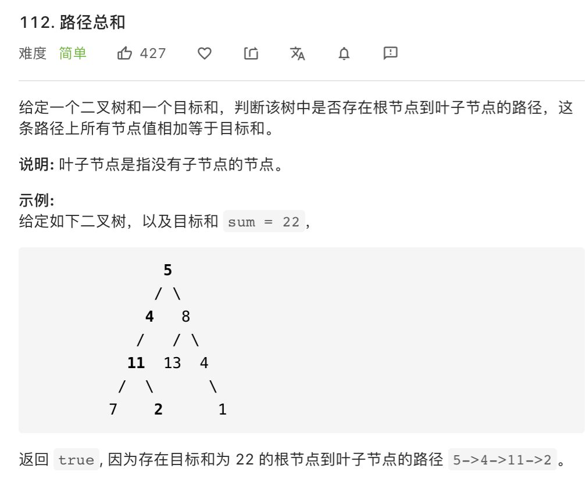

思路：二叉树相关的题目都可以使用递归来解决。

结合前面二叉树的几道题，我们发现，二叉树的递归题目都可以先完成一遍计算，然后分别递归左子树和右子树的部分。

```javascript
// 递归左子树和右子树的部分
return getSum(root.left, curSum, sum) || getSum(root.right, curSum, sum)
```


```javascript
/**
 * Definition for a binary tree node.
 * function TreeNode(val) {
 *     this.val = val;
 *     this.left = this.right = null;
 * }
 */
/**
 * @param {TreeNode} root
 * @param {number} sum
 * @return {boolean}
 */
const getSum = function(root, curSum, sum) {
    if(root === null) {
        return false
    }
    curSum += root.val
    if(root.left === null && root.right === null) {
        return curSum === sum
    }
    return getSum(root.left, curSum, sum) || getSum(root.right, curSum, sum)
}
const hasPathSum = function(root, sum) {
    return getSum(root, 0 ,sum)
}
```

**复杂度分析**

- 时间复杂度：O(n)。
- 空间复杂度：空间复杂度：O(h)。其中 `h` 是树的高度。
  - 空间复杂度主要取决于递归时栈空间的开销，最坏情况下，树呈现链状，空间复杂度为 O(n)。
  - 平均情况下树的高度与节点数的对数正相关，空间复杂度为 O(log n)。
