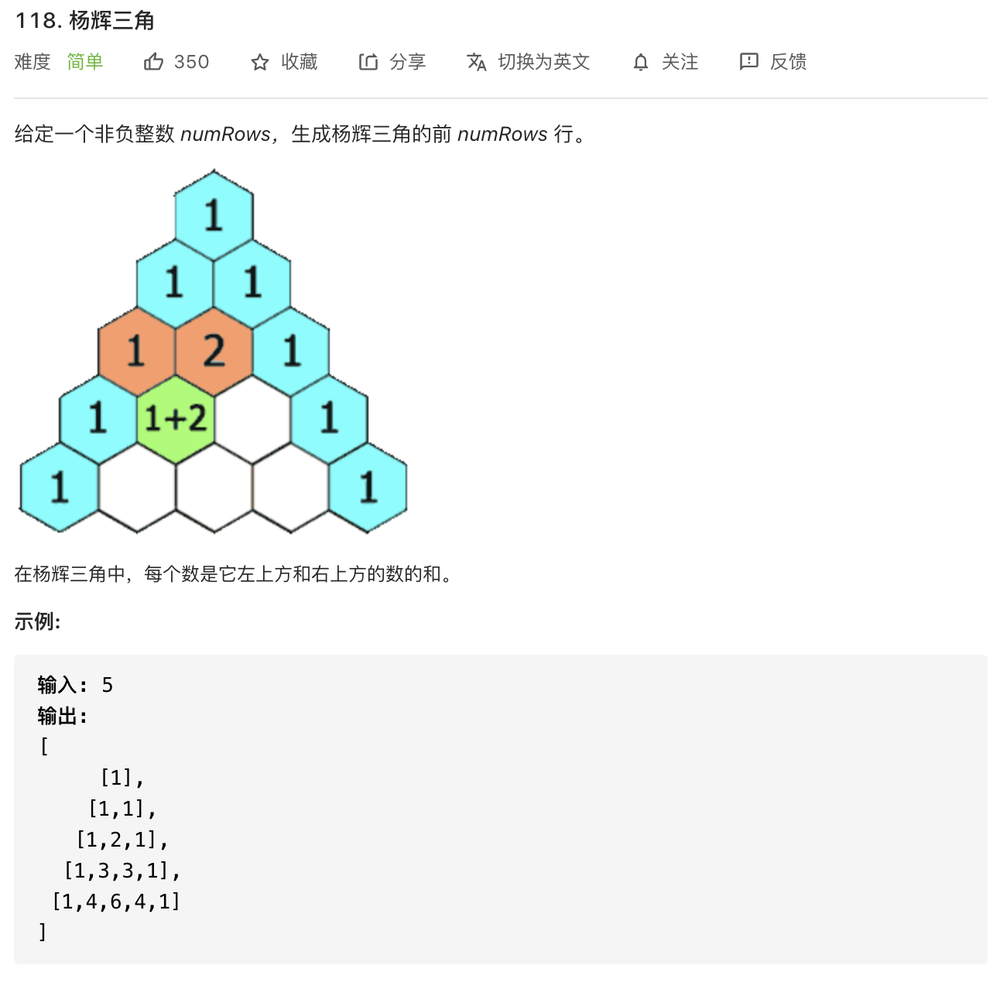

思路：终于告别了二叉树的题目，但是**勿忘：二叉树的题目还是一定要经常回顾**。

这道题的规律从第 2 行起（下标从 0 开始）看起，其实就可以找到：

1. 每行首尾都是 1

2. 第 1 个元素起（下标从 0 开始），比如下标为 x，每个元素都是上一行数组 `row` 的 `row[x - 1] + row[x]` 之和。

```javascript
row[j] = row[i-1][j-1] + row[i-1][j]
```

然后再补充下其他逻辑即可。


```javascript
/**
 * @param {number} numRows
 * @return {number[][]}
 */
const generate = function(numRows) {
            let result = []
            for (let i = 0; i < numRows; i++) {
                let row = []
                // 头尾两个元素初始化为0
                row[0] = 1
                row[i] = 1
                // 头尾两个以外的元素进行计算
                for (let j = 1; j < i; j++) {
                    row[j] = result[i - 1][j - 1] + result[i - 1][j]
                }
                result.push(row)
            }
            return result
}
```
