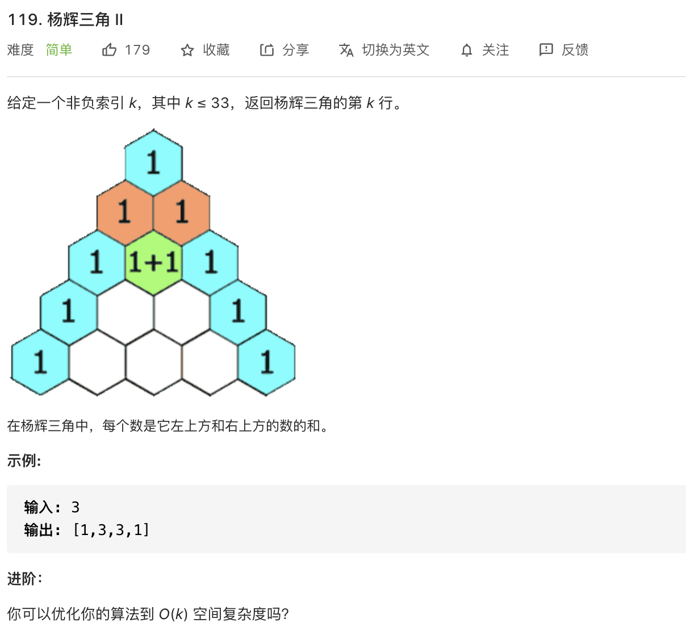
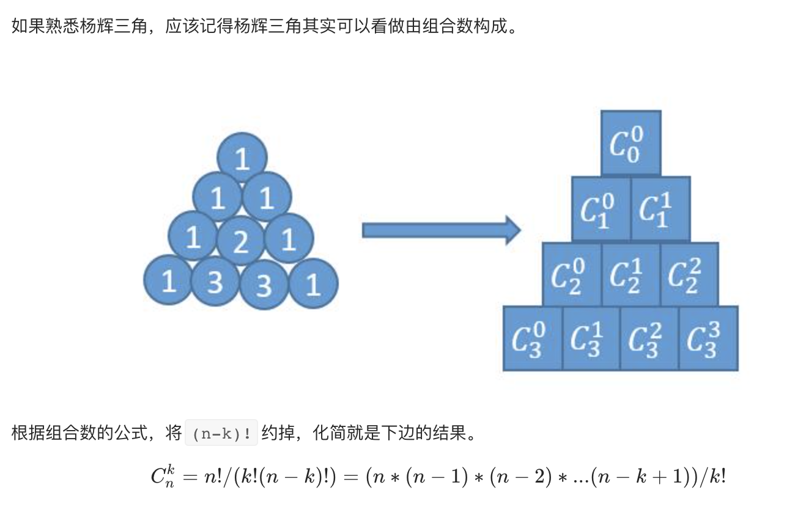

思路：和第 118 道题一样，依旧是杨辉三角。区别在于之前是输出所有层的数，这道题只需要输出第 `k` 层的数。


#### 方法一 ####

和第 118 道题一样，我们只需要一层一层的求。

但是不需要把每一层的结果都保存起来，**只需要保存上一层的结果**，就可以求出当前层的结果了。

```javascript
const getRow = function(rowIndex) {
            let row = []
            let rowLast = []
            for (let i = 0; i <= rowIndex; i++) {
                row = []
                // 头尾两个元素初始化为0
                row[0] = 1
                row[i] = 1
                // 头尾两个以外的元素进行计算
                for (let j = 1; j < i; j++) {
                    row[j] = rowLast[j - 1] + rowLast[j]
                }
                rowLast = row
            }
            return row
}
```

<br/>

#### 方法二

注意这道题在最后提了一个问题：你可以优化你的算法到 O(k) 空间复杂度吗？

也就是最多一层遍历——看来当然是可以的，那么怎么样才能实现？




```javascript
const getEach = function(rowIndex, eleIndex) {
            let ele = 1
            // 倒着计算
            for(let i = 1; i <= eleIndex; i++) {
                ele = ele * (rowIndex - eleIndex + i) / i
            }
            return ele
}
const getRow = function(rowIndex) {
            let result = []
            for(let eleIndex = 0; eleIndex <= rowIndex; eleIndex++) {
                result.push(getEach(rowIndex, eleIndex))
            }
            return result
}
```

`getEach()` 还可以继续优化，详见：https://leetcode-cn.com/problems/pascals-triangle-ii/solution/xiang-xi-tong-su-de-si-lu-fen-xi-duo-jie-fa-by--28/

