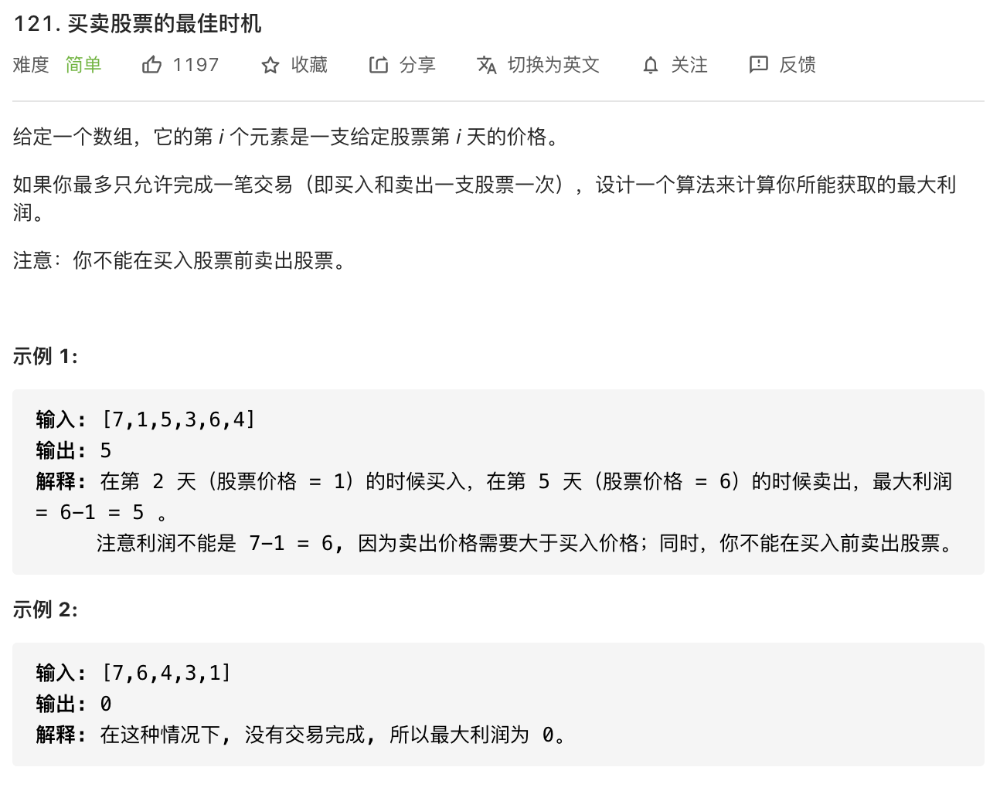

#### 方法一 ####

使用暴力法，逐一比较，假如计划在第 i 天卖出股票，那么最大利润的差值一定是在 [0, i-1] 之间选最低点买入。

本质是比较并找出 `arr[i]` 与其以后元素相差最大值。

```javascript
const maxProfit = function(prices) {
            let profit = 0
            for(let i = 0; i < prices.length; i++) {
                for(let j = i + 1; j < prices.length; j++) {
                    let temp = prices[j] - prices[i]
                    if(profit < temp){
                        profit = temp
                    }
                }
            }
            return profit
}
```

**复杂度分析**

- 时间复杂度：O(n^2)
- 空间复杂度：O(1)

<br/>

#### 方法二

鲁迅说过，暴力法肯定不是最优解。

记录历史最低点，然后同时找最大相差值。

```javascript
 const maxProfit = function(prices) {
            let minPrice = prices[0]
            let maxProfit = 0
            for(let i = 0; i < prices.length; i++) {
                if (prices[i] < minPrice) {   // 找出最小值买入
                    minPrice = prices[i]
                } else {    // 否则往后看，找最大相差值
                    if (prices[i] - minPrice > maxProfit) {
                        maxProfit = prices[i] - minPrice
                    }
                }
            }
            return maxProfit
}
```

**复杂度分析**

- 时间复杂度：O(n)
- 空间复杂度：O(1)