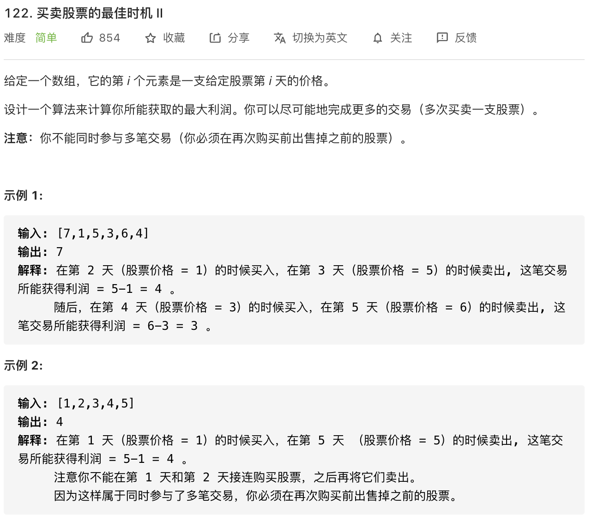

思路：相比第 121 道题，这道题是支持多次交易，所以是需要累加相差最大值，而不是取某一的最大值。

举例：[1, 7, 2, 3, 6, 7, 6, 7]

1, 7(7-1=6), 2, 3(3-2=1), 6(6-3=3) , 7(7-6=1), 6, 7(6-7=1) —— 6 + 1 + 3 + 1 + 1 = 12

```javascript
const maxProfit = function(prices) {
            let maxprofit = 0
            for (let i = 1; i < prices.length; i++) {
                if (prices[i] > prices[i - 1])
                    maxprofit += prices[i] - prices[i - 1]
            }
            return maxprofit
}
```

**复杂度分析**

- 时间复杂度：O(n)
- 空间复杂度：O(1)
