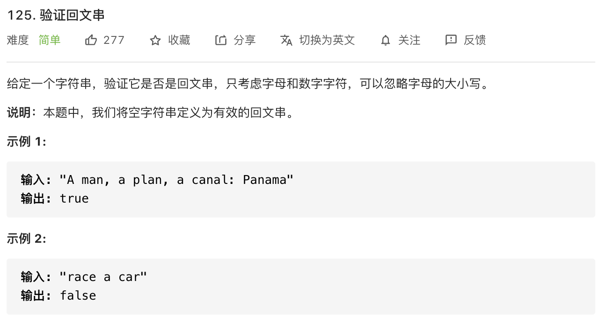

思路：回文串的解决方法一共 3 种，包括：

- API
- 栈
- 双指针

注意只考虑字母和数字字符。


#### 方法一

API：

```javascript
const isPalindrome = function(s) {
  					// 将非数字和字母的字符过滤掉
            const str = s.replace(/[^0-9a-zA-Z]/g, '').toLowerCase()
            // 反转字符串
            const reverseStr = str.split('').reverse().join('')
            return reverseStr === str
}
```

<br/>


#### 方法二

双指针：

```javascript
const isPalindrome = function(s) {
            s = s.replace(/[^0-9a-zA-Z]/g, '').toLowerCase()
            let right = s.length - 1
            let left = 0
            while(left < right) {
                if(s[left] !== s[right]) {
                    return false
                }
                left++
                right--
            }
            return true
}
```


