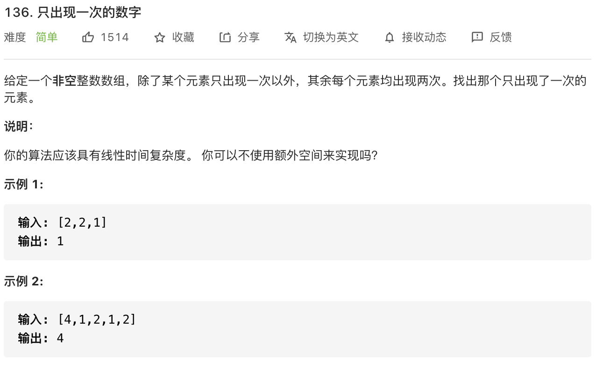

思路：注意说明，能不能不使用额外空间来实现。

算法题做到现在，发现有两个规律，**当不会做的时候，可以考虑递归或位运算。**

> **位运算**
>
> 1. a ^ 0 = a
> 2. a ^ a = 0
> 3. a ^ b ^ a = b ^ a ^ a = b ^ ( a ^ a)

```javascript
const singleNumber = function(nums) {
    let single = 0
    nums.forEach(num => {
        single = single ^ num
    })
    return single
}
```
