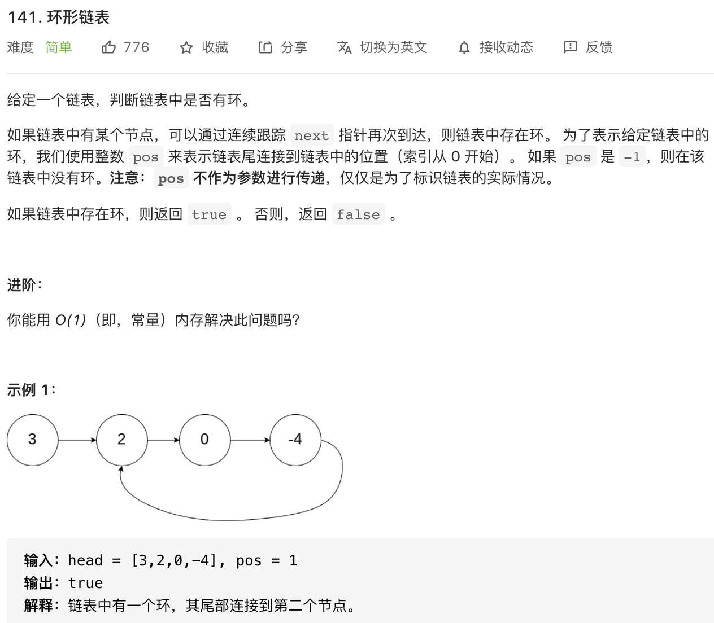

#### 方法一 ####

采用**哈希表**的方法：利用额外空间，生成一个对象，存储遍历的节点，并进行判断。

```javascript
const hasCycle = function(head) {
    while(head){
       if (head.cycle) {
          return true
       }
       head.cycle = 1
       head = head.next
    }
    return false
}
```

**复杂度分析**

- 时间复杂度：O(n)
- 空间复杂度：O(n)


#### 方法二 ####

进阶版：要求用 O(1) 内存解决此问题。

采用**双指针**的方法：想象一下，两名运动员以不同的速度在环形赛道上跑步会发生什么——会终究相遇。

注意：当测试用例为单个元素，比如 [1]，则视为 `false`。

```javascript
const hasCycle = function(head) {
     // 如果链表为空，或只有一个节点，则为 false
     if(head === null || head.next === null) {
         return false
     }
     let slow = head
     let fast = head.next
     while(slow !== fast) {
          // 如果 fast 指针已经走到最后，则为 false
          if(fast === null || fast.next === null) {
              return false
          }
          slow = slow.next
          fast = fast.next.next
     }
     return true
}
```

**复杂度分析**

- 时间复杂度：O(n)
- 空间复杂度：O(1)，没有额外的变量。

