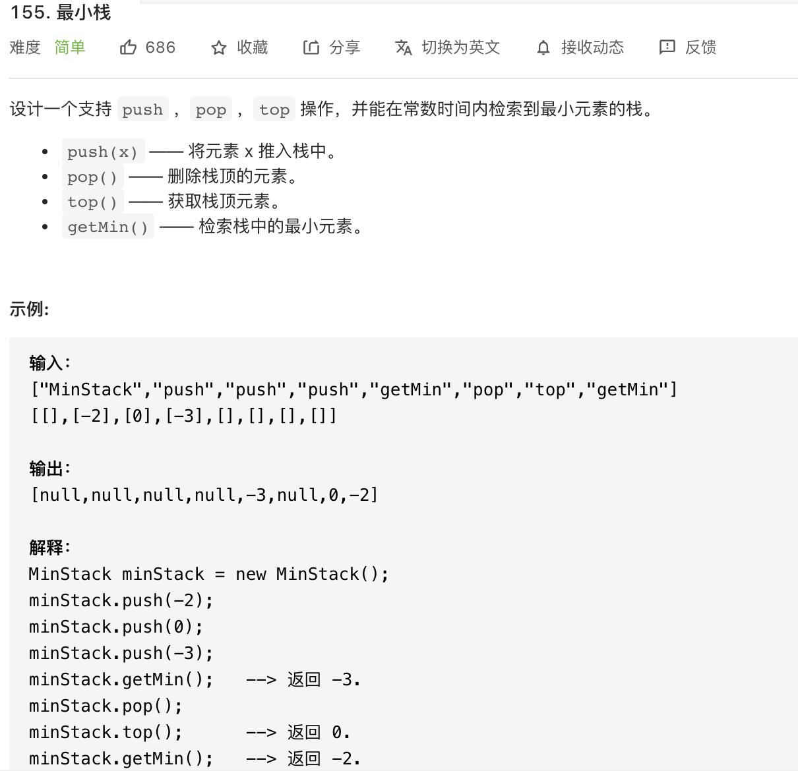

思路：使用辅助栈。

```javascript
const MinStack = function() {
    this.eleStack = []
    // Infinity = ?
    this.minEleStack = [Infinity]
}
// 注意获取最小值的实现！在每个元素入栈时，把当前栈的最小值存储起来——这样最小栈数组的栈顶元素永远是最小值。
MinStack.prototype.push = function (ele) {
    this.eleStack.push(ele)
    this.minEleStack.push(Math.min(ele, this.minEleStack[this.minEleStack.length - 1]))
}
// 当出栈时，最小值数组的栈顶元素一起弹出。
MinStack.prototype.pop = function () {
    this.eleStack.pop()
    this.minEleStack.pop()
}
MinStack.prototype.top = function () {
    return this.eleStack[this.eleStack.length - 1]
}
MinStack.prototype.getMin = function () {
    return this.minEleStack[this.minEleStack.length - 1]
}
```

**复杂度分析**

- 时间复杂度：O(1)
- 空间复杂度：O(n)

