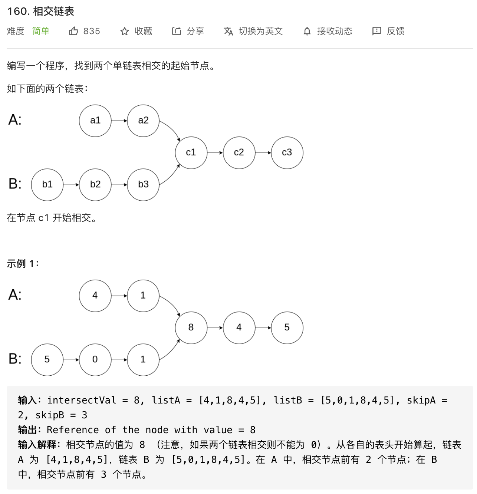
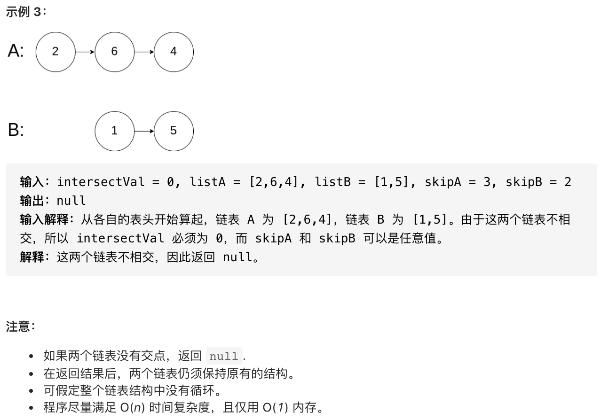

#### 方法一 ####

暴力法，对于链表 A 中的每一个节点，遍历整个链表 B，并检查 B 中是否存在和 A 相同的节点。

**复杂度分析**

- 时间复杂度：O(mn)
- 空间复杂度：O(1)


#### 方法二 ####

哈希表

```javascript
const getIntersectionNode = function(headA, headB) {
    while(headA) {
         headA.cycle = 1
         headA = headA.next
    }
  	// 若相交，则 headB 的 cycle 也会有值
    while(headB !== null){
         if (headB.cycle) {
             return headB
         }
         headB = headB.next
    }
    return null
}
```

**复杂度分析**

- 时间复杂度：O(m+n)
- 空间复杂度：O(m) 或 O(n)


#### 方法三 ####

双指针法，与第 144 道题类似。

```javascript
const getIntersectionNode = function(headA, headB) {
     let pA = headA
     let pB = headB

     // 如果 A 或 B 链表为空，则为 null
     if(pA === null || pB === null) {
          return null
     }
     // 如果 A === B，则直接输出 pA 或 pB
     if(pA === pB) {
         return pA
     }
     // 注意：这边遍历到最后，会重定向到对方的头节点。
     while(pA !== pB) {
          pA = pA === null ? headB : pA.next
          pB = pB === null ? headA : pB.next
     }
     return pA
}
```

**复杂度分析**

- 时间复杂度：O(m+n)
- 空间复杂度：O(1)

