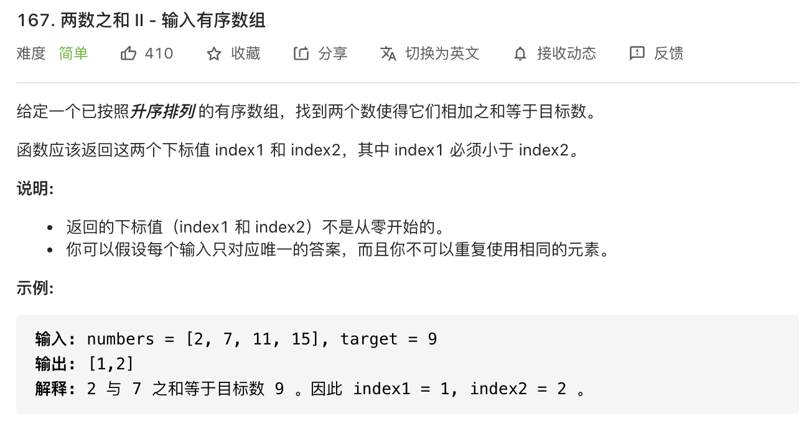

思路：注意说明的第一点，返回的下标值不是从零开始的。


#### 方法一 ####

暴力法，需要两层遍历。

```javascript
const twoSum = function(numbers, target) {
     for(let i = 0; i<numbers.length; i++) {
          if(numbers[i] > target) {
              break
          }
          for(let j = i + 1; j<numbers.length; j++) {
              const add = numbers[i] + numbers[j]
              if(add > target) {
                   break
              }
              if(add === target) {
                   return [i + 1, j + 1]
              }
          }
     }
     return [-1, -1]
}
```

**复杂度分析**

- 时间复杂度：O(n^2)
- 空间复杂度：O(1)


#### 方法二 ####

以上方法适用于无序数组，但这次题目是明确指出来是有序数组。**涉及有序数组的查找都可以采用二分查找，**这样会快一些。

```javascript
const twoSum = function(numbers, target) {
    for(let i = 0; i<numbers.length; i++) {
        let left = i + 1
        let right = numbers.length - 1
        while(left <= right) {
             let mid = Math.floor((right - left) / 2) + left
             if (numbers[i] + numbers[mid] < target) {
                  left = mid + 1
             } else if (numbers[i] + numbers[mid] > target) {
                  right = mid - 1
             } else {
                  return [i + 1, mid + 1]
             }
        }
    }
    return [-1, -1]
}
```

**复杂度分析**

- 时间复杂度：O(n logn)。遍历数组一遍是O(n)，二分查找是O(logn)，所以总时间复杂度是 O(n logn)。
- 空间复杂度：O(1)
