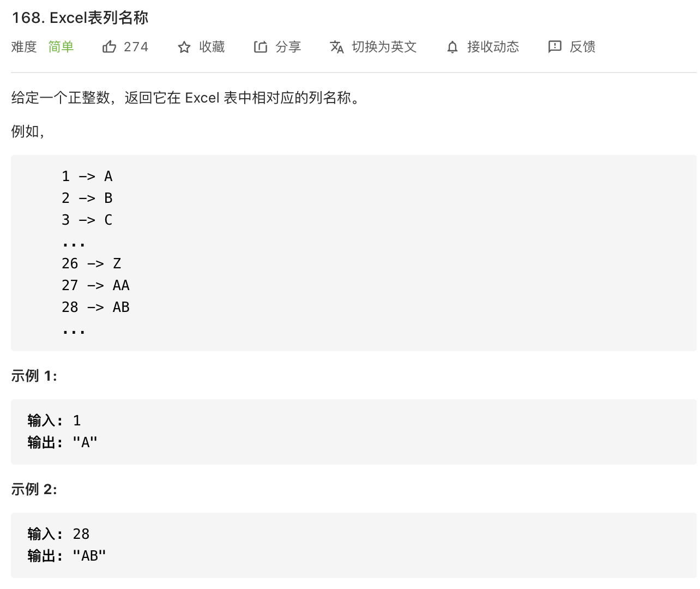

思路：每次计算前先减 1。

```javascript
const convertToTitle = function(n) {
     const map = ['A', 'B', 'C', 'D', 'E', 'F', 'G', 'H', 'I', 'J', 'K', 'L', 'M', 'N', 'O', 'P', 'Q', 'R', 'S', 'T', 'U', 'V', 'W', 'X', 'Y', 'Z']
     let result = ''
     while(n > 0) {
         n--
    		 // 从低位开始，获取对应字母
         result = map[n % 26] + result
       	 // 获取下标
         n = Math.floor(n / 26)
     }
     return result
}
```

