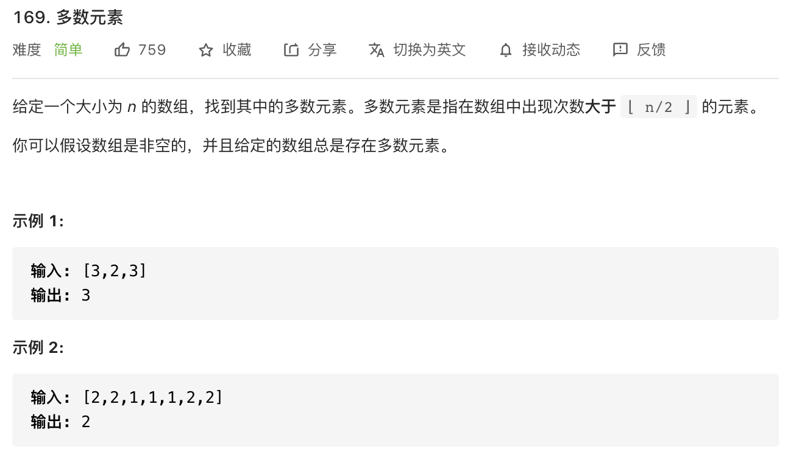

#### 方法一 ####

使用原生提供的api，先排序，后取中间下标的数，一定是多数元素。

```javascript
const majorityElement = function(nums) {
    const numsBySort = nums.sort((a, b) => {return a - b})
    return numsBySort[Math.floor(numsBySort.length / 2)]
}
```

**复杂度分析**

- 时间复杂度：O(nlogn) ，使用了快速排序
- 空间复杂度 ：O(1) 


#### 方法二 ####

记录每个元素出现的次数，若超过了 `nums.length / 2`，即超过一半，则是多数元素。

```javascript
const majorityElement = function(nums) {
    let half = nums.length / 2
    let obj = {}
    for(let num of nums) {
        obj[num] = (obj[num] || 0) + 1
      	// 题目说了给定的数组总是存在多数元素，所以可以只处理一个 return
        if(obj[num] > half) {
             return num
        }
    }
}
```

**复杂度分析**

- 时间复杂度：O(n) 
- 空间复杂度 ：O(n) 


#### 方法三

两两不同的数抵消，这样一来，多数元素肯定是会被剩下的。

```javascript
 const majorityElement = function(nums) {
     let x = 0
     let m = 0
     for(let num of nums) {
         if (m === 0) {
            x = num
         }
         m = m + (x === num ? 1 : -1)
     }
     return x
}
```

**复杂度分析**

- 时间复杂度：O(n) 
- 空间复杂度 ：O(1) 