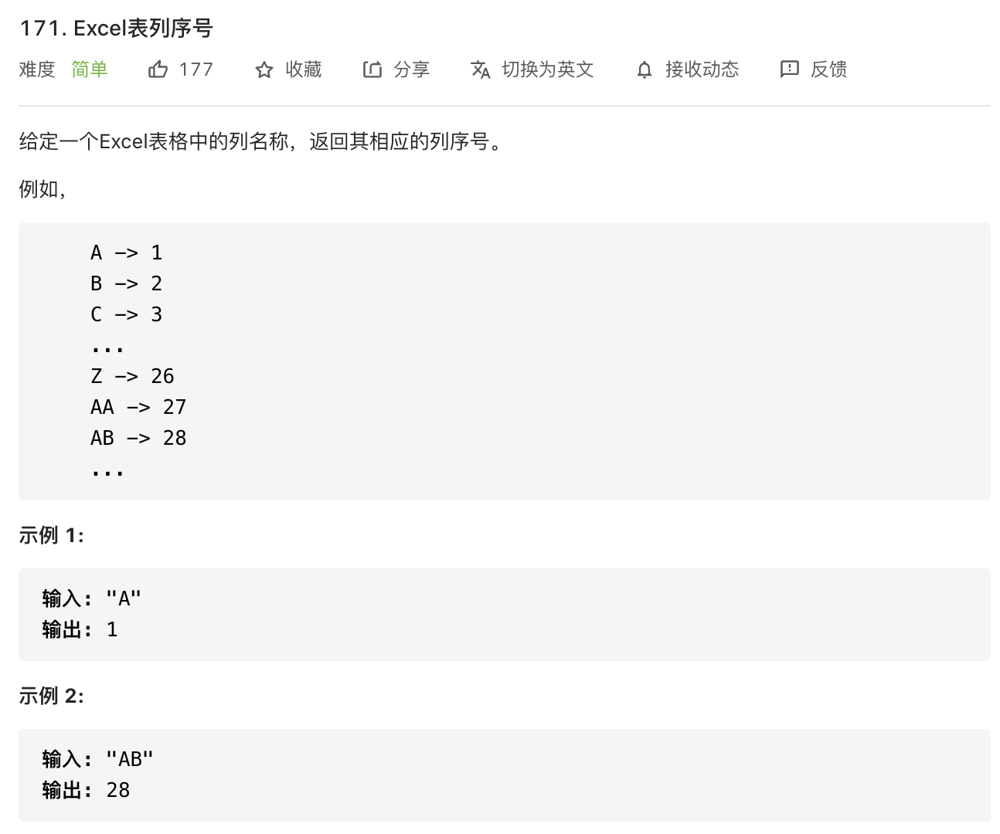

```javascript
const titleToNumber = function(s) {
     const map = ['A', 'B', 'C', 'D', 'E', 'F', 'G', 'H', 'I', 'J', 'K', 'L', 'M', 'N', 'O', 'P', 'Q', 'R', 'S', 'T', 'U', 'V', 'W', 'X', 'Y', 'Z']
     let result = 0
     let index = 0
     // 从高位开始
     for(let i = 0; i < s.length; i++) {
          let num = map.indexOf(s[i]) + 1
          result = result * 26 + num
     }
     return result
}
```
