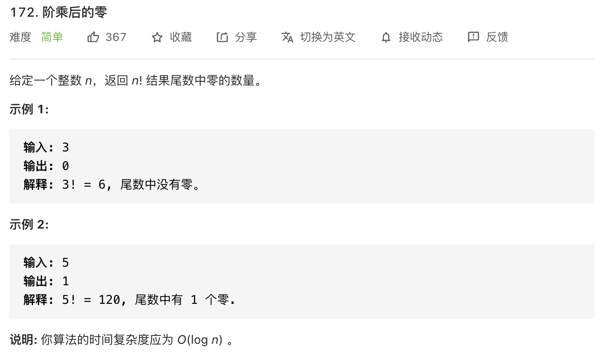

思路：这道题如果直接先计算阶乘结果，再来计算结果中有多少个0是不现实的。计算量实在太大，容易超时。

只能想想有没别的办法——**这道题，要找阶乘中能产生0的规律。**

**举例**

`11! `

`= 11 * 10 * 9 * 8 * 7 * 6 * 5 * 4 * 3 * 2 * 1 `

`= 11 * (2 * 5) * 9 * (4 * 2) * 7 * (3 * 2) * (1 * 5) * (2 * 2) * 3 * (1 * 2) * 1`

对于含有 2 的因子的话是 1 * 2,  2 * 2, 3 * 2, 4 * 2 ...

对于含有 5 的因子的话是 1 * 5, 2 * 5...


**规律**

- 含有 2 的因子每两个出现一次，含有 5 的因子每 5 个出现一次。

- 所有 2 出现的个数远远多于 5。
- 换言之找到一个 5，一定能找到一个 2 与之配对。所以我们只需要找有多少个 5。

直接的，我们只需要判断每个累乘的数有多少个 5 的因子即可。


**再往下推，规律就是每隔 `5` 个数，出现一个 `5`，每隔 `25` 个数，出现 `2` 个 `5`，每隔 `125` 个数，出现 `3` 个 `5`... 以此类推。**

```javascript
const trailingZeroes = function(n) {
    let num = 0
    while (n >= 5) {
        num = num + Math.floor(n / 5)
        n = n / 5
    }
    return num
}
```
