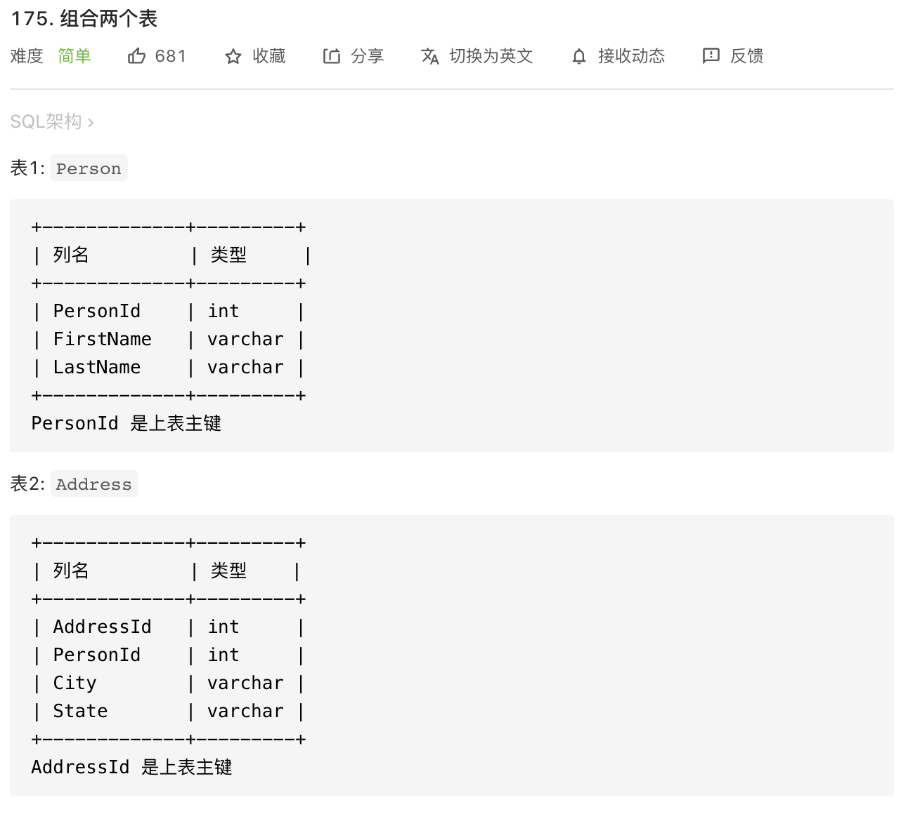
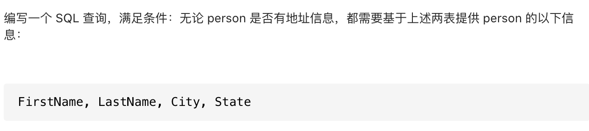

emmm严格意义来看，这道题不算是算法题，是常见的 SQL 题目。

```mysql
# Write your MySQL query statement below
select FirstName, LastName, City, State
from Person left join Address
on Person.PersonId = Address.PersonId
```
