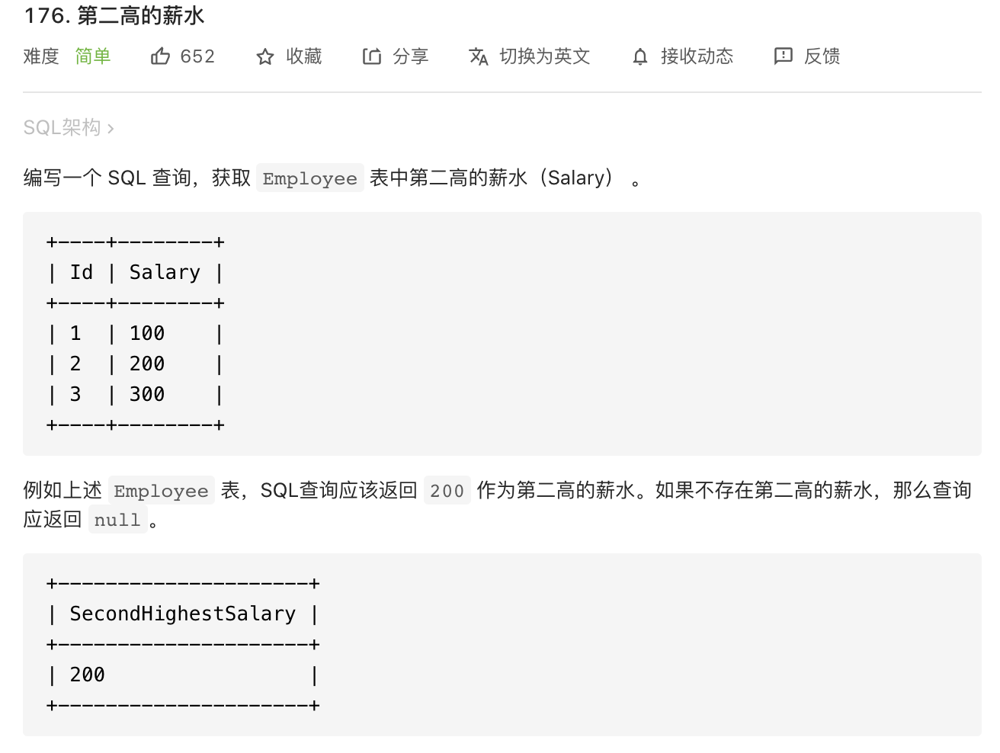

这道题仍不是算法题，主要考察 SQL 的：`ifnull`, `limit` 等。

```mysql
# Write your MySQL query statement below
select ifnull((select distinct `Salary`
from `Employee`
order by `Salary` desc
limit 1,1), null) as `SecondHighestSalary`
```
