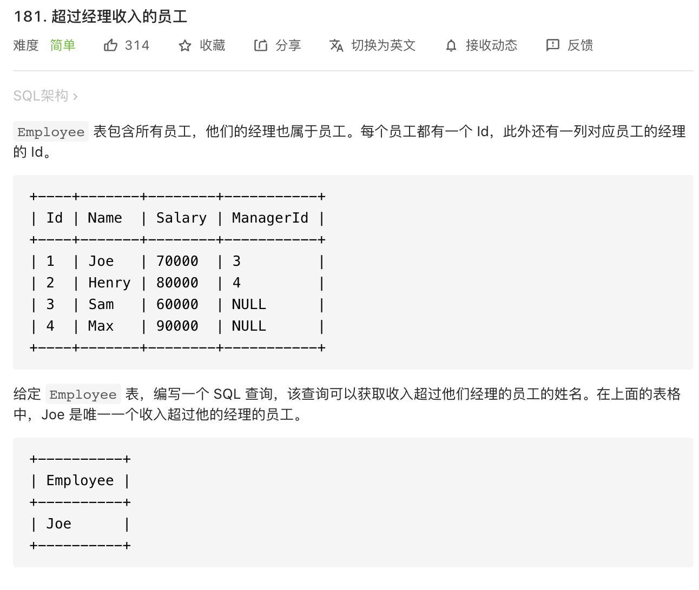

思路：注意每个员工都有自己的经理，比较的是哪些是收入超过自己的经理的员工。

```mysql
# Write your MySQL query statement below
select a.`name` as `Employee`
from `Employee` as `a`,`Employee` as `b` 
where a.`ManagerId` = b.`Id` and a.`Salary` > b.`Salary`
```
