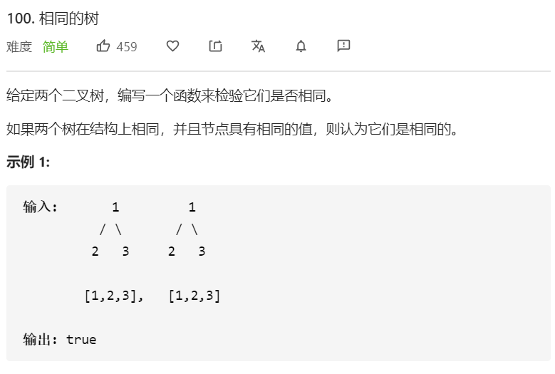

思路：深度优先遍历

如果两个二叉树都不为空，那么首先判断它们的根节点的值是否相同，若不相同则两个二叉树一定不同，若相同，再分别判断两个二叉树的左子树是否相同以及右子树是否相同。

这是一个递归的过程，因此可以使用深度优先搜索，递归地判断两个二叉树是否相同。

```javascript
/**
 * Definition for a binary tree node.
 * function TreeNode(val, left, right) {
 *     this.val = (val===undefined ? 0 : val)
 *     this.left = (left===undefined ? null : left)
 *     this.right = (right===undefined ? null : right)
 * }
 */
/**
 * @param {TreeNode} p
 * @param {TreeNode} q
 * @return {boolean}
 */
var isSameTree = function(p, q) {
      if(p === null && q === null) {
        return true
      }
      if(p === null || q === null) {
        return false
      }
      return p.val === q.val && isSameTree(p.left, q.left) && isSameTree(p.right, q.right)
}
```

**复杂度分析**

- 时间复杂度：O(min(m, n))
- 空间复杂度：O(min(m, n))。取决于递归调用的层数。