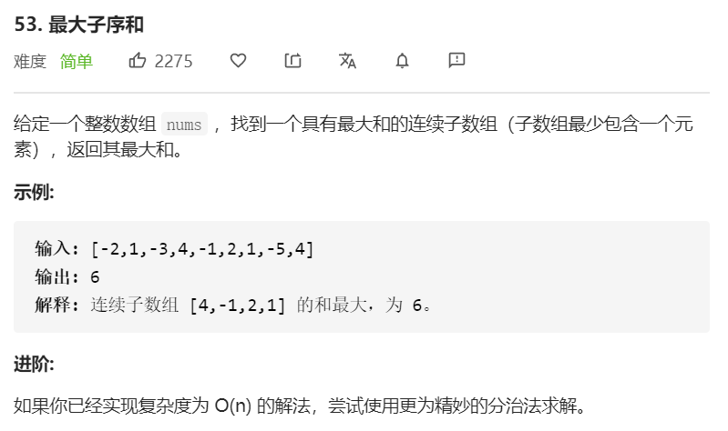

最大和的连续子数组是指找到一段子数组，其相加之和是整段看下来，数值最大的。

思路：贪心法

从第一个元素开始，计算：

比较 当前元素 和 当前元素+上一个元素之和，得出resultA，再和与当前最大值resultB相比，取较大值。

```javascript
var maxSubArray = function(nums) {
     let maxNum = nums[0]
     let pre = 0
     nums.forEach(ele => {
         pre = Math.max(ele, pre + ele)
         maxNum = Math.max(maxNum, pre)
     })
     return maxNum
}
```

**复杂度分析**

- 时间复杂度：O(n)
- 空间复杂度：O(1)