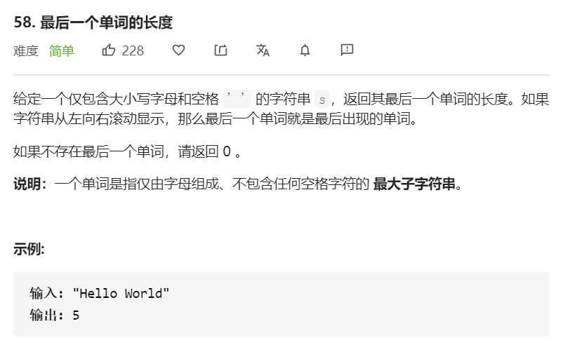

最后一个单词就是指常见的一段英文里，以空格为间隔符，查找到的最后一个单词。

思路：从后往前遍历，找到的第一个空字符串位置 减去 第一个非空字符串的位置。

注意：

- 整段的最末尾可能有空字符串。
- 可能该段英文只有一个字母。

```javascript
var lengthOfLastWord = function(s) {
     let end = s.length - 1
     // 找到第一个非' '的元素。注意是空格！
     while(end >= 0 && s[end] === ' ') {
        end--
     }
     if(end < 0) {
         return 0
     }
     let start = end
    // 找到第一个' '的元素
     while(start >= 0 && s[start] !== ' ') {
         start--
     }
     return end - start
}
```

