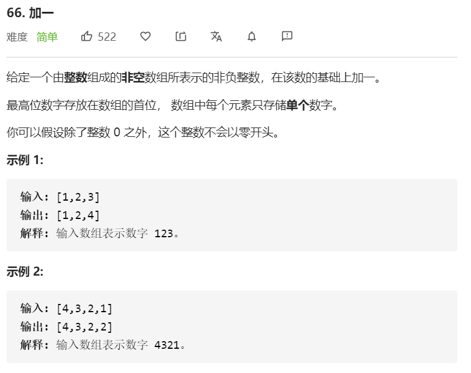

这题比较简单，但容易忽略特殊情况。一开始我踩了两个坑。

**第一个坑**

**没有考虑到  digits`  表示的整数 > JavaScript的整数最大值。**

整数的范围：−9007199254740992  ~ 9007199254740992 （即：正负2∧53）

我首先想到的，是一个很挫的方法：

**数组 → 数字 → 数字加1 → 转回数组**

如果 `digits` 超过最大值 9007199254740992（16位数），则不通过。


**第二个坑**

**没有考虑到当 digits 表示的整数为9，需要最后补充 unshift()。**

采用逐位进一的方法。但注意覆盖当前元素应该是 `digits[i] = result % 10`， 而不是 `digits[i] = result`。

```javascript
var plusOne = function(digits) {
     let add = 1
     for(let i = digits.length - 1; i>=0; i--) {
         let result = digits[i] + add
         // 覆盖当前元素
         digits[i] = result % 10
         // 若有进一位，取处在十位上的数
         add = result >= 10 ? Math.floor(result / 10) : 0
     }
     if(add > 0) {
         digits.unshift(add)
     }
     return digits
}
```

