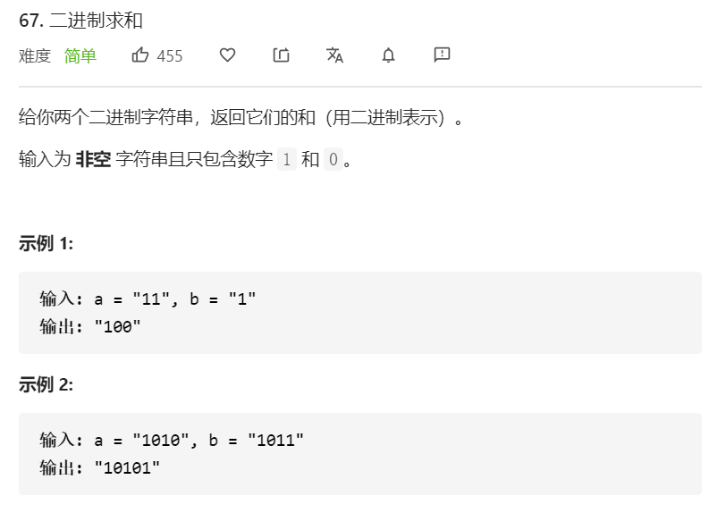

首先需要将 `a` 和 `b` 以最后一位为准对齐，并且从最后一位开始计算。

整体计算与第 66 道题《加一》类似，也是逐位相加，并且需要考虑进位。

```javascript
 const addBinary = function(a, b) {
        // 计算结果
        let result = ''
        // 进位值
        let add = 0
        // 从a和b的最后一位开始进行计算，当a或b都遍历到0时，停止遍历
        for (let i = a.length - 1, j = b.length - 1; i>=0 || j>=0; i--, j--){
          let sum = add
          sum += i >= 0 ? Number(a[i]) : 0
          sum += j >= 0 ? Number(b[j]) : 0
          // result字符串追加结果（需要考虑进位，如计算结果为2，则追加2%2=0）
          result += sum % 2
          // add赋值为当前进位值（如计算结果为3，则覆盖为3/2向下取整为1）
          add = Math.floor(sum / 2)
        }
        if (result === 1) {
          result += add
        }
        return result.split('').reverse().join('')
 }
```

