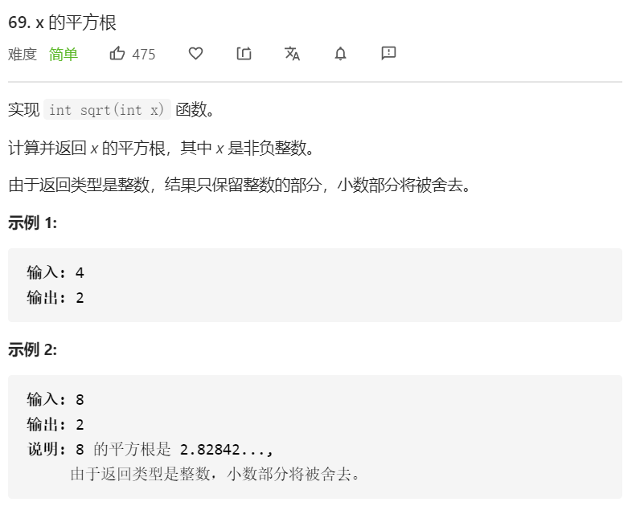

在顺序的数组里查找，就要使用二分查找法。把枚举分成两段，步步逼近。

**二分查找最关键的是要找准判断条件，可以跑几个测试用例检查下。**

```javascript
/**
 * @param {number} x
 * @return {number}
 */
const mySqrt = function(x) {
      let left = 0
      let right = x
      let res = 0
      while(left <= right){
        let mid = Math.floor((left + right) / 2)
        if(mid * mid <= x) {
          // 赋值
          res = mid
          // 当最终值在右半段，则 left 往右移动
          left = mid + 1
        } else {
          // 当最终值在左半段，则 right 往左移动
          right = mid - 1
        }
      }
      return res
}
```

