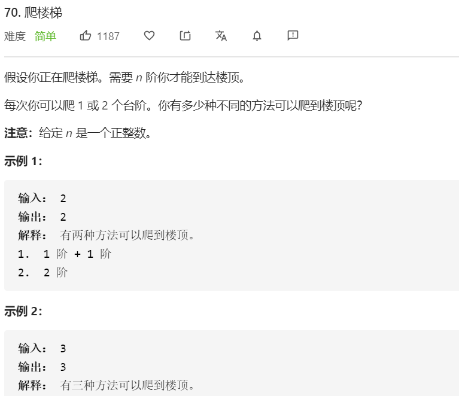

这道题其实是基于**斐波那契数列**的变形实现。

首先，我们先来看经典的斐波那契数列。

```javascript
// 基础版
var fibonacci = function (n) {
      let res = 0
      if(n < 1) {
        return 0
      }
      if(n < 2) {
        return 1
      }
      return fibonacci(n - 1) + fibonacci(n - 2)
}
// 数组缓存优化版
var climbStairs = function (n) {
      let res = 0
      let temp = [0, 1]
      if(n < 1) {
        return 0
      }
      if(n < 2) {
        return 1
      }
      if(!temp[n]) {
        result = climbStairs(n - 1) + climbStairs(n - 2)
        temp[n] = result
      }
      return result
}
```

这道题，同样是 `f(n) = f(n - 1) + f(n - 2)`，同样可以采用动态规划实现。

<br/>

再次复习下定义：动态规划是一种解题思路，递归是一种代码运行方式。**动态规划可以通过递归实现**。

使用递归的方法解动态规划问题时，为了充分利用重叠子问题的性质，需要存储已经计算得到的子问题的答案。

```javascript
var climbStairs = function (n) {
      // x - 1
      let p = 0
      // x - 2
      let q = 0
      let res = 1
      for(let i = 1; i <= n; i ++) {
        p = q
        q = res
        res = p + q
      }
      return res
}
```

<br/>

**复杂度分析**

- 时间复杂度：O(n)
- 空间复杂度：O(1)