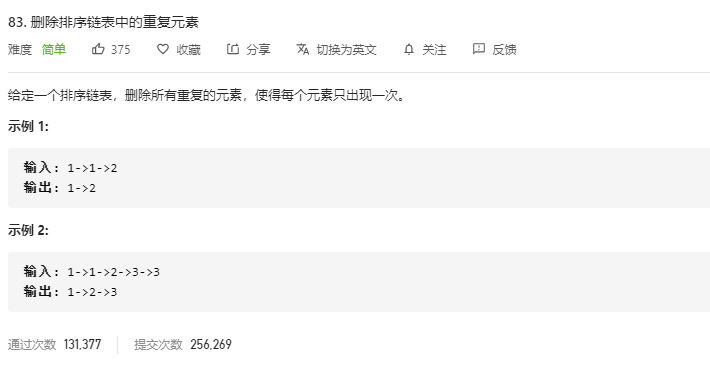

思路：

- 指定 `cur` 指向 `head`
- 当 `cur` 和 `cur.next` 都存在时，遍历链表。
- 当 `cur.val === cur.next.val` ，则说明存在重复元素，需要删除处理。否则 `cur` 移动到下一个位置。继续循环。

```javascript
const deleteDuplicates = function(head) {
    let cur = head
    while(cur && cur.next) {
      if(cur.val === cur.next.val) {
        // 可以理解为跳过该重复元素，这样能达到去重的效果
        cur.next = cur.next.next
      }else{
        cur = cur.next
      }
    }
    // 链表的head地址就是链表的地址，返回head即可
    return head
}
```


**复杂度分析**

- 时间复杂度：O(n)
- 空间复杂度：O(1)

