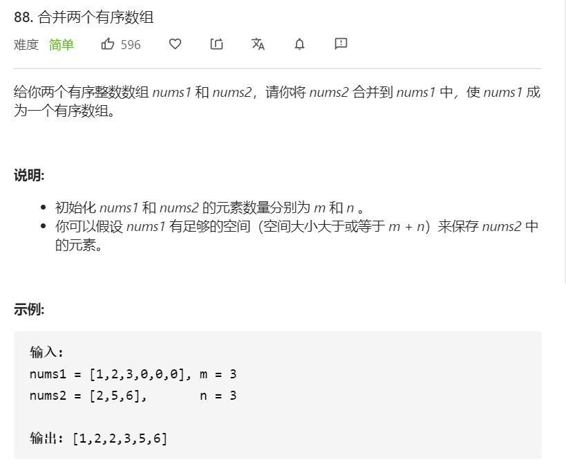

讲道理，一开始我真没看懂这道题。

既然是有序数组，那为什么 `nums1` 是这样的：`[1,2,3,0,0,0]`，后面几个0是什么意思？

后来我才明白，`m = 3`其实就是规定了 `nums1` 和 `nums2` 的有序元素个数。即如果定了 `m = 3`，那么第四个元素起，其实就可以忽略了。

**然后要注意，这道题不需要返回某个值，而是读取 `nums1` 自动作为返回值。**所以如果修改了 `nums1` 不是预期结果数组，而是赋值给了别的变量，则执行会报错。

<br>

#### 方法一

 思路：将两者先截取，然后合并，再排序。

```javascript
/**
 * @param {number[]} nums1
 * @param {number} m
 * @param {number[]} nums2
 * @param {number} n
 * @return {void} Do not return anything, modify nums1 in-place instead. // 注意
 */
var merge = function(nums1, m, nums2, n) {
    nums1.splice(m)
    nums2.splice(n)
    nums1.push(...nums2)
    nums1.sort((a, b) => a - b)
}
```

这种方法没有用到原数组已经排序的优势。

<br>

#### 方法二

思路：`nums1` 先截取，然后从前往后逐一比较，然后注意要考虑剩余元素追加的特殊情况。

目前实现的代码写法还是比较繁琐，可以继续简化。

```javascript
/**
 * @param {number[]} nums1
 * @param {number} m
 * @param {number[]} nums2
 * @param {number} n
 * @return {void} Do not return anything, modify nums1 in-place instead. // 注意
 */ 
var merge = function(nums1, m, nums2, n) {
      let nums1Temp = nums1.slice(0, m)
      let i = 0
      let j = 0
      let p = 0
      while(i < m && j < n){
        nums1[p++] = nums1Temp[i] < nums2[j] ? nums1Temp[i++] : nums2[j++]
      }
      // 若num2已经被比较完毕，而nums1Temp还有元素
      if(i < m){
        nums1.splice(i + j)
        nums1.push(...nums1Temp.splice(i, m + n - i - j))
      }
      // 若nums1Temp已经被比较完毕，而nums2还有元素
      if(j < n){
        nums1.splice(i + j)
        nums1.push(...nums2.splice(j, m + n - i - j))
      }
}
```

